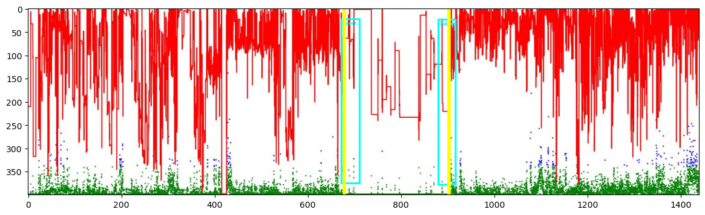

# **CS584_Machine-Learning_Project**

-----

>  Team:
>
>  [@Xue Zhang](https://github.com/zhangxue0111)
>
>  [@Hongbo Wang](https://github.com/BOBWang1117)
>
>  

## **Environment:**

- Anaconda: 23.7.4

- python: 3.11.5

  

## **Details**

- Type: term project
- Professor: Yan Yan
- Developing Language: Python
- Project Name: Child Sleep State Detection from Wrist-Worn Accelerometer Data Using A Faster R-CNN Model
- Time: Dec/1/2023
- Description: 

## **Dependencies:** 

- Kaggle data set: https://www.kaggle.com/competitions/instacart-market-basket-analysis/data

## **Install package:**

- torch: 2.1.0
- pandas: 2.0.3
- numpy: 1.24.3
- tqdm: 4.65.0
- faster_rcnn: 4.65.0

## **Run program:**

Method:

- Download Anaconda and necessary environment
- Download the [datasets](https://www.kaggle.com/competitions/instacart-market-basket-analysis/data)
- Run faster-rcnn-final.ipynb file

## **Example:**

1. The screenshot of Model Architecture.

   

   

   2. The result:

      
   
      
   
   3. No anotation:
   
      
   
      
   
   4. Annotation:
   
      
   
      
   
   5. Predict annotation:
   
      
   
   
   
   

